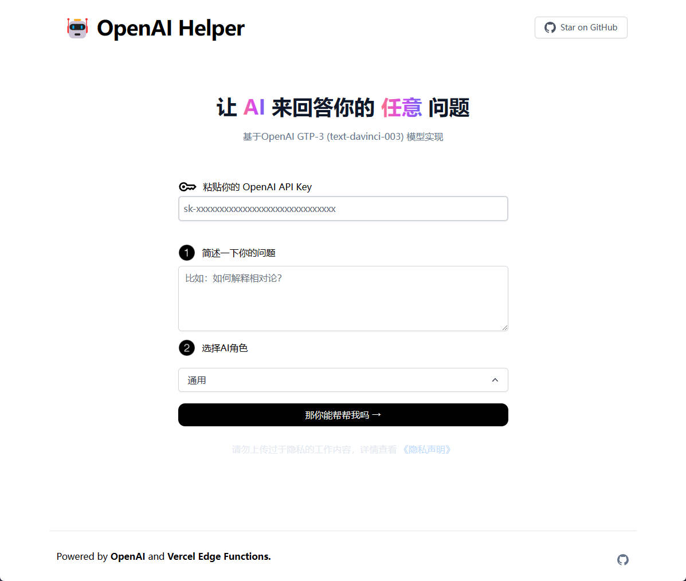

# OpenAI Helper

基于不同角色的形式来回答特定的专业性问题

[](https://github.com/Hk-Gosuto/openai-helper)

## 这个项目是如何工作的
这个项目主要使用了 [OpenAI GPT-3 API](https://openai.com/api/) 和 [Vercel Edge functions](https://vercel.com/features/edge-functions)。它根据用户输入构建一个Prompt，通过Vercel Edge函数将其发送到GPT-3 API，然后将响应流传回应用程序。

## 在本地运行

clone此repo，去 [OpenAI](https://openai.com/api/) 注册一个账号，拿到API key，放到`.env`文件。本地文件`.env.example`要改成`.env`。


确保你本地的npm命令生效，执行以下命令
```bash
npm install
npm run dev
```
打开 `http://localhost:3000`


## 线上一键部署

用 [Vercel](https://vercel.com?utm_source=github&utm_medium=readme&utm_campaign=vercel-examples) 一键部署:

[](https://vercel.com/new/clone?repository-url=https://github.com/Hk-Gosuto/openai-helper&env=OPENAI_API_KEY,NEXT_PUBLIC_USE_USER_KEY,OPENAI_MODEL&project-name=openai-helper&repo-name=openai-helper)

环境变量如下所示：
```
OPENAI_API_KEY=xxxxx
NEXT_PUBLIC_USE_USER_KEY = false
OPENAI_MODEL = text-davinci-003
```

## 感谢

项目基于 [weekly_report](https://github.com/guaguaguaxia/weekly_report) 和 [teach-anything](https://github.com/lvwzhen/teach-anything) 开发